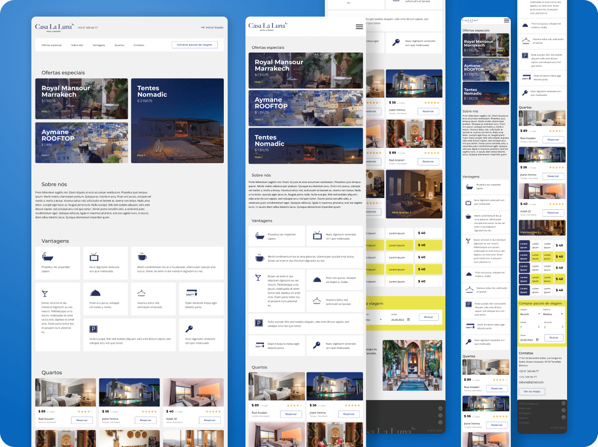

# 📱 Website Responsivo Casa La Luna 🌙🏠

Este é o terceiro projeto do Curso de Desenvolvimento de Layout em Front-end da Mentorama. Casa La Luna é um site para um resort que oferece serviços de hospedagem, desenvolvido para as versões Mobile, Tablet e Desktop.

 

## 👨🏾‍💻 Desafio do Projeto
 
Os desafios foram muitos: começar a explorar a metodologia BEM, aprender a responsividade utilizando Flexbox em conjunto com Media Queries e o CSS Grid foi a tarefa mais complexa. Cada desafio foi superado e conquistado com êxito, e a superação marcava uma nova conquista, mostrando o crescimento e as habilidades adquiridas.

 

## 📸 Screenshots

 

## 🚀 Tecnologias Utilizadas

- HTML5
- CSS3

 

## 🏆 Aprendizado 

- Mobile First
- Responsividade
- Metodologia BEM
- CSS Grid
- Media Query

 

# 🧠 Próximos Passos
Aprimorar as habilidades adquiridas e fixar o aprendizado  
desenvolvendo o site para o projeto final do curso: [Design Systems](https://github.com/domfabio/Projeto-Final-Website-Responsivo-Design-Systems).

 

## 🔗 Projeto Hospedado no Vercel
Este projeto está disponível para visualização online através do Vercel.  
Você pode acessá-lo através do link: https://casa-la-luna.vercel.app/
